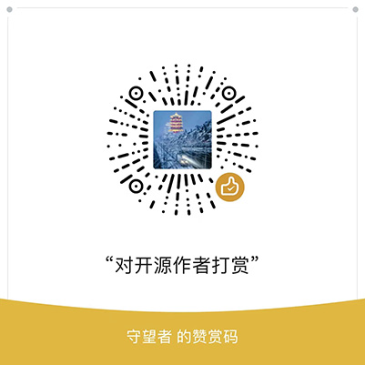

# Code Manager

#### Introduction
 tool for quickly recording and querying code snippets, helping you improve your programming learning and development speed. Supports syntax highlighting for mainstream programming languages such as Java, Python, C, C++, C#, PHP, HTML, JS, VB, SQL, MATLAB, JSON, XML, and many others. Supports code categorization, quick multi-condition querying, and file attachment saving.

#### Software Architecture
1.  Developed with VB6.0
2.  Uses an ACCESS database
3.  WebView2 framework

#### Installation Guide
1.  This software relies on the Edge browser engine. Ensure that Microsoft Edge or the Edge runtime is installed on your computer.
2.  Download the Edge runtime here: https://developer.microsoft.com/en-us/microsoft-edge/webview2
3.   you encounter the error "Unable to bind with WebView2," please run the reg.vbs script.

#### Source Code Download
1.  代码管家源代码.zip
2.  Download and unzip the above files to obtain the complete source code

#### Software Interface
 **Dark Theme:** 

 **Light colored theme:** 

 **Adjust the size freely and remember:** 

 **Select/Add Category:** 

 **When searching with multiple keywords, you can choose the 'and' or 'query method:** 

#### Donations and Support
If you like this project and find it helpful, you are welcome to donate through the following methods to help me continue maintaining and improving the software. Every bit of support means a lot to me, and I appreciate your encouragement!🙏

